<!--
██╗  ██╗ █████╗  ██████╗██╗  ██╗███████╗██████╗ 
██║  ██║██╔══██╗██╔════╝██║ ██╔╝██╔════╝██╔══██╗
███████║███████║██║     █████╔╝ █████╗  ██████╔╝
██╔══██║██╔══██║██║     ██╔═██╗ ██╔══╝  ██╔══██╗
██║  ██║██║  ██║╚██████╗██║  ██╗███████╗██║  ██║
╚═╝  ╚═╝╚═╝  ╚═╝ ╚═════╝╚═╝  ╚═╝╚══════╝╚═╝  ╚═╝
                                                 
 SYSTEM: LOCAL_SVG_INTEGRATION
 USER: Robot0P
 THEME: CUSTOM_BANNER
-->

  
  <!-- 1. HEADER: MATRIX ANIMATION -->
  

    

  <!-- 
      2. CUSTOM TERMINAL ANIMATION (LOCAL SVG)
      使用 ./banner.svg 引用本地生成的 SVG
  -->
  

   

  <!-- 3. BADGES & STATUS -->
  

    <!-- Visitor Badge -->
    
     
    <!-- Tech Stack Strip -->
    
    
    
    
  

<!-- 4. STATS (Minimalist Black) -->
<table align="center" style="border: 0;">
  <tr>
    <td align="center" style="border: 0; background-color: transparent;">
      
    </td>
    <td align="center" style="border: 0; background-color: transparent;">
      
    </td>
  </tr>
</table>

<!-- 5. ACTIVITY GRAPH (Full Width) -->

   
  <code style="color: #00FF00;">root@kali:~# view_network_logs --full</code>
    
  

<!-- 6. FOOTER -->
 

  

